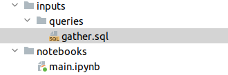

GoWork: Easily Works
=======================

GoWork it's a nice tool to your daily analysis, to be easy connect throw your databases and keep your credentials saved and secured.
Every query that you receive is built on `pandas <https://pandas.pydata.org/>`_, a commun tool in Data Science and Data Analysis.

**First of all, some steps to work easy**

You need to save your credential by this examples above:

**REMEMBER: You can include many kinds of connection and you need to configure just once**

.. code-block:: python

    from gowork.safe.configs import Credentials
    c = Credentials()

**Athena**

.. code-block:: python

    c.insert(name='datalake',
         connector='athena',
         credentials={'aws_access_key_id': 'XXXXXXXXXXXX',
                     'aws_secret_access_key': 'XXXXXXXXXXXXX',
                     's3_staging_dir': 's3://XXXXXXXXXXX/',
                     'region_name': 'us-east-1'},
         encode=['aws_access_key_id', 'aws_secret_access_key']
        )

**Mysql**

.. code-block:: python

    c.insert(name='dw_prod',
         connector='mysql',
         credentials={'host': 'XXXXXXXXX',
                      'database': 'XX',
                      'password': 'XXXXXXXXXX',
                      'port': 3306,
                      'user': 'XXXXXXXXXX'},
         encode=['password', 'user']
         )

**MongoDB**

.. code-block:: python

    c.insert(name='atlas',
         connector='mongodb',
         credentials={'database': 'XXXXXXX',
                      'url': 'mongodb+srv://XXXXXXXXXXXXXXXXXXXXXXXXX'},
         encode=['url']
         )

[IMPORTANT]: the field ``encode`` is what sets it has to be encrypted or not !!

----

**Let's work**

.. code-block:: python

    from gowork.databases import AthenaGo
    a = AthenaGo('datalake')

    a.read_sql('''SELECT * FROM "dataset"."prices" p''')

When you are working in a big query or in a big project that uses many queries, there another tool to help you.
You need just say where your queries are keeped, then you need just to select by the name of the file, using **GoQuery**.

.. code-block:: python

    from gowork.databases import AthenaGo, GoQuery
    a = AthenaGo('datalake')
    q = GoQuery('../inputs/queries')

    df = a.read_sql(q.use('gather'))

----

 Observation about MongoDB
We are looking at an unstructured data, it's works like Json so see that example when you are filtering a document in other document

.. code-block:: python

    from gowork.databases import MongoGo

    m = MongoGo('FATEC')
    m.read_sql('SELECT id_cliente, forma_envio FROM pedidos')
In order to get just a specific field in ``forma_envio`` like ``tipo``

.. code-block:: python

    m.read_sql('SELECT id_cliente, forma_envio.tipo FROM pedidos')